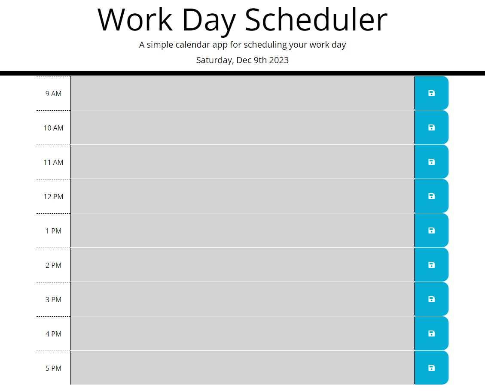

# Work-Day-Scheduler

## Description:
- This Scheduler meant to help create and organize daily tasks or event. On top of the page, the current date will be displayed and below you will see the hours between 9AM and 5PM.

## Usage
- Enter event or task on corresponding time and hit the save button to store in their local storage.
- Past event or task will be display in grey,
- Present time will display in red,
- Future event or task will be displayed in green.

https://stephaniemnz.github.io/Work-Day-Scheduler/